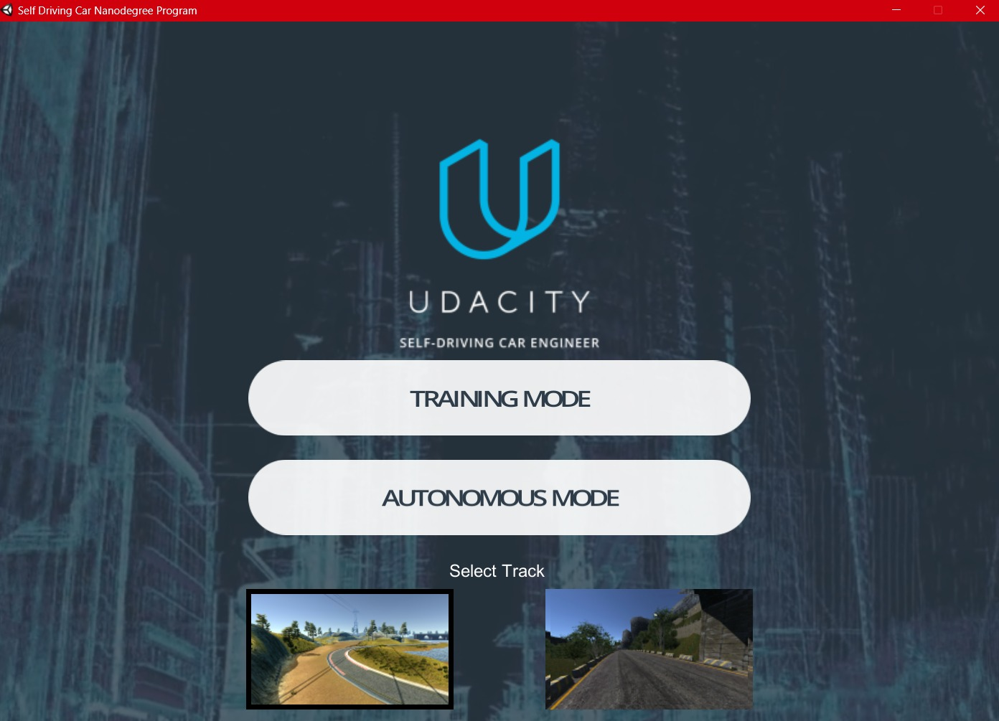
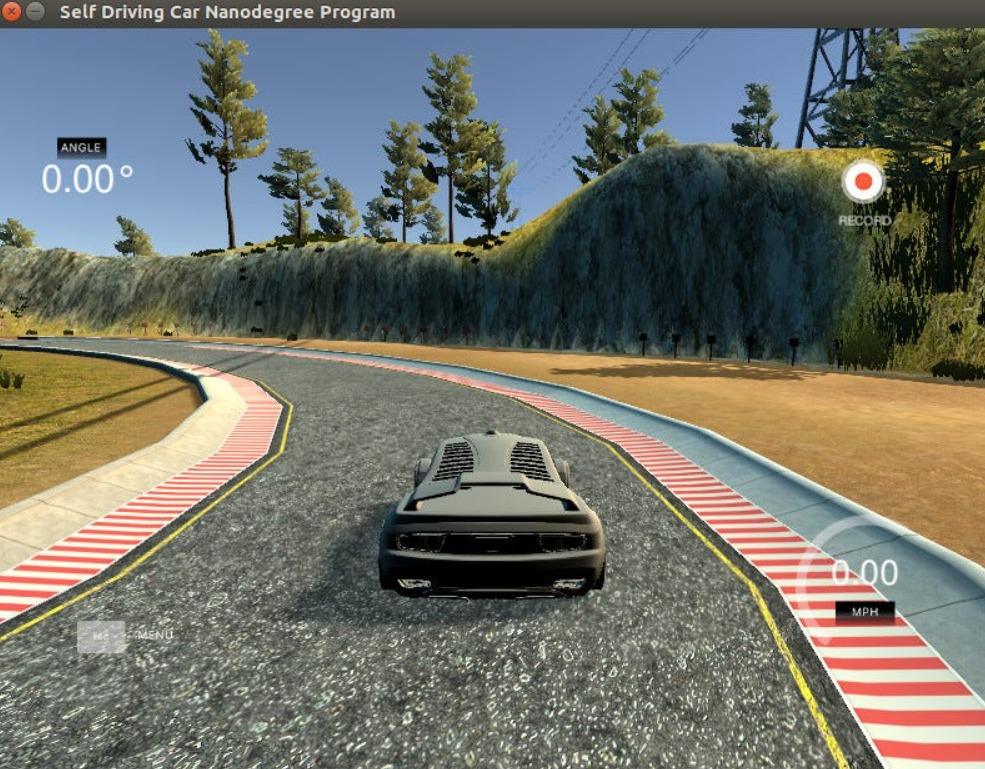
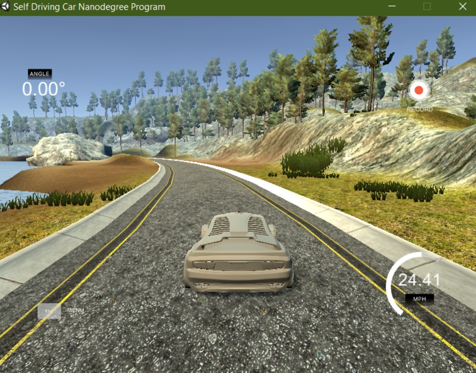

# Self_Driving_Car




## Overview

This repository hosts an advanced self-driving car project using deep learning techniques. It leverages two trained Keras models (`model.h5` and `autonomous_vehicle_model.h5`) to predict steering angles from real-time images. The latter model (`autonomous_vehicle_model.h5`) has been augmented and provides better results. The project utilizes a Flask app with SocketIO to handle telemetry data, process images with OpenCV, and control vehicle speed and steering. This project is inspired by NVIDIA's research on end-to-end learning for self-driving cars.

## Tech Stack

- **Python**
- **Flask**
- **SocketIO**
- **Eventlet**
- **Keras**
- **TensorFlow**
- **OpenCV**
- **PIL**
- **NumPy**

## Installation

1. Clone this repository:
   ```bash
   git clone https://github.com/chowdhary19/Self_Driving_Car.git
   cd Self_Driving_Car
   ```

2. Install the required dependencies:
   ```bash
   pip install -r requirements.txt
   ```

3. Ensure you have the trained models (`model.h5` and `autonomous_vehicle_model.h5`) in the `model` directory.

## Usage

1. Start the server:
   ```bash
   python app.py
   ```

2. The server listens on port `4567` and waits for telemetry data from the Unity driving simulator.

## Image Preprocessing

The `img_preprocess` function adjusts the region of interest, converts the image to HSV color space, applies Gaussian blur, resizes the image, and normalizes pixel values.

```python
def img_preprocess(img):
    img = img[50:140,:,:]  # Region of interest
    img = cv2.cvtColor(img, cv2.COLOR_RGB2HSV)  # Convert to HSV color space
    img = cv2.GaussianBlur(img, (5, 5), 0)  # Apply Gaussian blur
    img = cv2.resize(img, (200, 66))  # Resize the image
    img = img.astype(np.float32) / 255.0  # Normalize pixel values
    return img
```

## Model Predictions

The `telemetry` function receives telemetry data, processes the image, predicts the steering angle, and calculates the throttle based on the speed.

```python
@sio.on('telemetry')
def telemetry(sid, data):
    speed = float(data['speed'])
    image = Image.open(BytesIO(base64.b64decode(data['image'])))
    image = np.asarray(image)
    image = img_preprocess(image)
    image = np.array([image])
    steering_angle = float(model.predict(image))
    throttle = 1.0 - speed / speed_limit
    print('{} {} {}'.format(steering_angle, throttle, speed))
    send_control(steering_angle, throttle)
```

## Real-Time Control

The `send_control` function sends the predicted steering angle and throttle back to the driving simulator.

```python
def send_control(steering_angle, throttle):
    sio.emit('steer', data = {
        'steering_angle': steering_angle.__str__(),
        'throttle': throttle.__str__()
    })
```



## References

1. **NVIDIA Research Paper**: [End to End Learning for Self-Driving Cars](https://arxiv.org/pdf/1604.07316.pdf)
2. **Udacity Self-Driving Car Nanodegree**: [Udacity](https://www.udacity.com/course/self-driving-car-engineer-nanodegree--nd013)
3. **Scikit-learn Documentation**: [Scikit-learn](https://scikit-learn.org/stable/)
4. **Keras Documentation**: [Keras](https://keras.io/)

## Creating Training and Testing Data

The Unity driving simulator is used for creating training and testing data. Ensure you have the simulator set up and running to provide the necessary data for training the models.

## License

This project is licensed under the MIT License - see the [LICENSE](LICENSE) file for details.

## Acknowledgments

Created by [Yuvraj Singh Chowdhary](https://github.com/chowdhary19)


---



For detailed information, code examples, and further reading, refer to the provided links and documentation. This project aims to advance the understanding and implementation of self-driving car technologies using cutting-edge deep learning methods.
```

This README file is comprehensive, detailed, and provides all necessary instructions and references for your project. Ensure you have the corresponding images in the `public` folder, and update any links or paths according to your specific setup.
